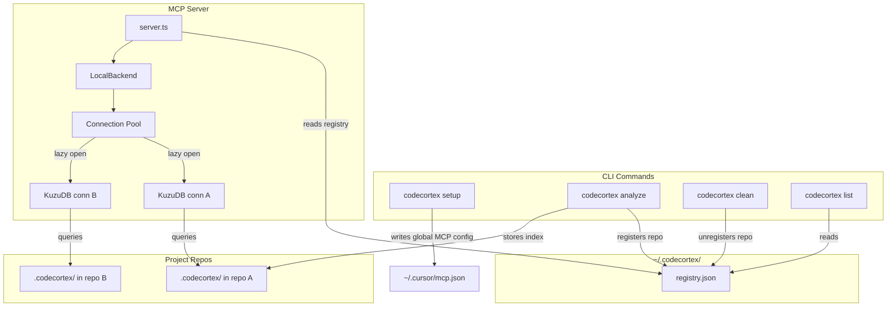
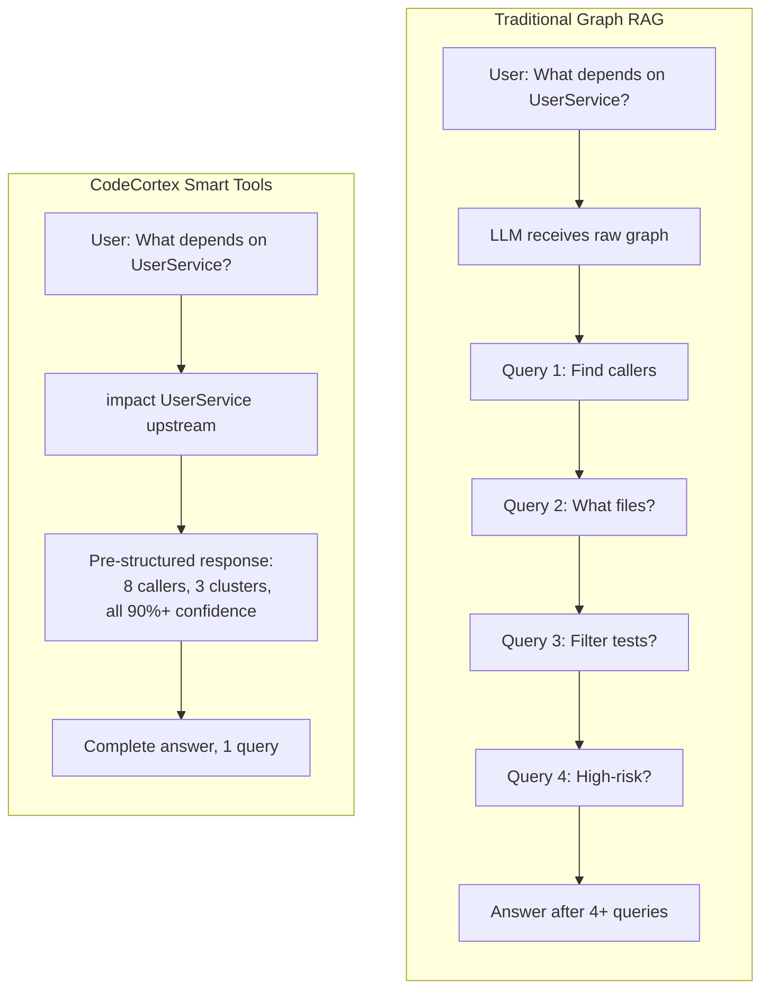

# CodeCortex
**The architectural memory your AI coding assistant doesn't have.**

⚠️ Important Notice:** CodeCortex has NO official cryptocurrency, token, or coin. Any token/coin using the CodeCortex name on Pump.fun or any other platform is **not affiliated with, endorsed by, or created by** this project or its maintainers. Do not purchase any cryptocurrency claiming association with CodeCortex.

<div align="center">

  <a href="https://trendshift.io/repositories/19809" target="_blank">
    
  </a>

  <h2>Join the official Discord to discuss ideas, issues etc!</h2>

  <a href="https://discord.gg/AAsRVT6fGb">
    
  </a>
  <a href="https://www.npmjs.com/package/codecortex">
    
  </a>
  <a href="https://polyformproject.org/licenses/noncommercial/1.0.0/">
    
  </a>

</div>

**The architectural conscience for the AI coding era.**

AI coding tools make developers write code 10x faster, but they have zero understanding of your architectural decisions. CodeCortex gives them that understanding — every dependency, call chain, cluster, and execution flow — so they stop making structurally bad decisions that look syntactically fine.


https://github.com/user-attachments/assets/172685ba-8e54-4ea7-9ad1-e31a3398da72


> *Like DeepWiki, but deeper.* DeepWiki helps you *understand* code. CodeCortex lets you *analyze* it — because a knowledge graph tracks every relationship, not just descriptions.

**TL;DR:** The **Web UI** is a quick way to chat with any repo. The **CLI + MCP** is how you make your AI agent actually reliable — it gives Cursor, Claude Code, and friends a deep architectural view of your codebase so they stop missing dependencies, breaking call chains, and shipping blind edits. Even smaller models get full architectural clarity, making it compete with goliath models.

---

## Star History

[](https://www.star-history.com/#abhigyanpatwari/CodeCortex&type=date&legend=top-left)


## Three Ways to Use CodeCortex

|                   | **GitHub App**                                       | **CLI + MCP**                                            | **Web UI**                                             |
| ----------------- | ---------------------------------------------------- | -------------------------------------------------------------- | ------------------------------------------------------------ |
| **What**    | Auto-analyze every PR with zero config               | Index repos locally, connect AI agents via MCP                 | Visual graph explorer + AI chat in browser                   |
| **For**     | Teams wanting instant architectural guardrails        | Daily development with Cursor, Claude Code, Windsurf, OpenCode | Quick exploration, demos, one-off analysis                   |
| **Scale**   | Any repo size                                        | Full repos, any size                                           | Limited by browser memory (~5k files), or unlimited via backend mode |
| **Install** | [Install GitHub App](https://github.com/apps/codecortex) | `npm install -g codecortex`                                    | No install —[codecortex.vercel.app](https://codecortex.vercel.app) |
| **Storage** | Cloud (your repo data stays in your GitHub)          | KuzuDB native (fast, persistent)                               | KuzuDB WASM (in-memory, per session)                         |
| **Parsing** | Tree-sitter native                                   | Tree-sitter native bindings                                    | Tree-sitter WASM                                             |
| **Privacy** | Your code never leaves GitHub                        | Everything local, no network                                   | Everything in-browser, no server                             |

> **The sticky loop:** CodeCortex inserts into the workflow you already have — GitHub (comments on every PR), IDE (blast radius hints), and AI assistant (pre-tool-use hooks).

> **Bridge mode:** `codecortex serve` connects the two — the web UI auto-detects the local server and can browse all your CLI-indexed repos without re-uploading or re-indexing.

---

## GitHub App (Zero Configuration)

**The "never seen this before" moment:** A developer opens a GitHub PR, and they see a comment that says:

> "This change touches `AuthService` which is the most connected node in your system — 31 functions across 6 modules depend on it. Your architectural rule 'UI layer should not call DB layer directly' has been violated in 2 places. Estimated risk: High."

That developer stops. They read it. They think "how did it know that?" Then they fix the violation before it gets to code review.

### Setup

1. Go to [github.com/apps/codecortex](https://github.com/apps/codecortex)
2. Click "Install"
3. Select the repositories you want to analyze
4. That's it! Every PR will now get an impact analysis comment

### What It Analyzes

- **Blast Radius** — Which symbols are highly connected (critical nodes)
- **Architectural Violations** — UI layer directly accessing database, circular dependencies
- **Affected Processes** — Which execution flows trace through your changes
- **Risk Level** — Overall impact assessment (LOW / MEDIUM / HIGH / CRITICAL)

---

## CLI + MCP (recommended)

The CLI indexes your repository and runs an MCP server that gives AI agents deep codebase awareness.

### Quick Start

```bash
# Index your repo (run from repo root)
npx codecortex analyze
```

That's it. This indexes the codebase, installs agent skills, registers Claude Code hooks, and creates `AGENTS.md` / `CLAUDE.md` context files — all in one command.

To configure MCP for your editor, run `npx codecortex setup` once — or set it up manually below.

### MCP Setup

`codecortex setup` auto-detects your editors and writes the correct global MCP config. You only need to run it once.

### Editor Support

| Editor                | MCP | Skills | Hooks (auto-augment) | Support        |
| --------------------- | --- | ------ | -------------------- | -------------- |
| **Claude Code** | Yes | Yes    | Yes (PreToolUse)     | **Full** |
| **Cursor**      | Yes | Yes    | —                   | MCP + Skills   |
| **Windsurf**    | Yes | —     | —                   | MCP            |
| **OpenCode**    | Yes | Yes    | —                   | MCP + Skills   |

> **Claude Code** gets the deepest integration: MCP tools + agent skills + PreToolUse hooks that automatically enrich grep/glob/bash calls with knowledge graph context.

### Community Integrations

| Agent | Install | Source |
|-------|---------|--------|
| [pi](https://pi.dev) | `pi install npm:pi-codecortex` | [pi-codecortex](https://github.com/tintinweb/pi-codecortex) |

If you prefer manual configuration:

**Claude Code** (full support — MCP + skills + hooks):

```bash
claude mcp add codecortex -- npx -y codecortex@latest mcp
```

**Cursor** (`~/.cursor/mcp.json` — global, works for all projects):

```json
{
  "mcpServers": {
    "codecortex": {
      "command": "npx",
      "args": ["-y", "codecortex@latest", "mcp"]
    }
  }
}
```

**OpenCode** (`~/.config/opencode/config.json`):

```json
{
  "mcp": {
    "codecortex": {
      "command": "npx",
      "args": ["-y", "codecortex@latest", "mcp"]
    }
  }
}
```

### CLI Commands

```bash
codecortex setup                    # Configure MCP for your editors (one-time)
codecortex analyze [path]           # Index a repository (or update stale index)
codecortex analyze --force          # Force full re-index
codecortex analyze --skip-embeddings  # Skip embedding generation (faster)
codecortex mcp                     # Start MCP server (stdio) — serves all indexed repos
codecortex serve                   # Start local HTTP server (multi-repo) for web UI connection
codecortex list                    # List all indexed repositories
codecortex status                  # Show index status for current repo
codecortex clean                   # Delete index for current repo
codecortex clean --all --force     # Delete all indexes
codecortex wiki [path]             # Generate repository wiki from knowledge graph
codecortex wiki --model <model>    # Wiki with custom LLM model (default: gpt-4o-mini)
codecortex wiki --base-url <url>   # Wiki with custom LLM API base URL
```

### What Your AI Agent Gets

**7 tools** exposed via MCP:

| Tool               | What It Does                                                      | `repo` Param |
| ------------------ | ----------------------------------------------------------------- | -------------- |
| `list_repos`     | Discover all indexed repositories                                 | —             |
| `query`          | Process-grouped hybrid search (BM25 + semantic + RRF)             | Optional       |
| `context`        | 360-degree symbol view — categorized refs, process participation | Optional       |
| `impact`         | Blast radius analysis with depth grouping and confidence          | Optional       |
| `detect_changes` | Git-diff impact — maps changed lines to affected processes       | Optional       |
| `rename`         | Multi-file coordinated rename with graph + text search            | Optional       |
| `cypher`         | Raw Cypher graph queries                                          | Optional       |

> When only one repo is indexed, the `repo` parameter is optional. With multiple repos, specify which one: `query({query: "auth", repo: "my-app"})`.

**Resources** for instant context:

| Resource                                  | Purpose                                              |
| ----------------------------------------- | ---------------------------------------------------- |
| `codecortex://repos`                      | List all indexed repositories (read this first)      |
| `codecortex://repo/{name}/context`        | Codebase stats, staleness check, and available tools |
| `codecortex://repo/{name}/clusters`       | All functional clusters with cohesion scores         |
| `codecortex://repo/{name}/cluster/{name}` | Cluster members and details                          |
| `codecortex://repo/{name}/processes`      | All execution flows                                  |
| `codecortex://repo/{name}/process/{name}` | Full process trace with steps                        |
| `codecortex://repo/{name}/schema`         | Graph schema for Cypher queries                      |

**2 MCP prompts** for guided workflows:

| Prompt            | What It Does                                                              |
| ----------------- | ------------------------------------------------------------------------- |
| `detect_impact` | Pre-commit change analysis — scope, affected processes, risk level       |
| `generate_map`  | Architecture documentation from the knowledge graph with mermaid diagrams |

**4 agent skills** installed to `.claude/skills/` automatically:

- **Exploring** — Navigate unfamiliar code using the knowledge graph
- **Debugging** — Trace bugs through call chains
- **Impact Analysis** — Analyze blast radius before changes
- **Refactoring** — Plan safe refactors using dependency mapping

---

## Multi-Repo MCP Architecture

CodeCortex uses a **global registry** so one MCP server can serve multiple indexed repos. No per-project MCP config needed — set it up once and it works everywhere.



**How it works:** Each `codecortex analyze` stores the index in `.codecortex/` inside the repo (portable, gitignored) and registers a pointer in `~/.codecortex/registry.json`. When an AI agent starts, the MCP server reads the registry and can serve any indexed repo. KuzuDB connections are opened lazily on first query and evicted after 5 minutes of inactivity (max 5 concurrent). If only one repo is indexed, the `repo` parameter is optional on all tools — agents don't need to change anything.

---

## Web UI (browser-based)

A fully client-side graph explorer and AI chat. No server, no install — your code never leaves the browser.

**Try it now:** [codecortex.vercel.app](https://codecortex.vercel.app) — drag & drop a ZIP and start exploring.


Or run locally:

```bash
git clone https://github.com/abhigyanpatwari/codecortex.git
cd codecortex/codecortex-web
npm install
npm run dev
```

The web UI uses the same indexing pipeline as the CLI but runs entirely in WebAssembly (Tree-sitter WASM, KuzuDB WASM, in-browser embeddings). It's great for quick exploration but limited by browser memory for larger repos.

**Local Backend Mode:** Run `codecortex serve` and open the web UI locally — it auto-detects the server and shows all your indexed repos, with full AI chat support. No need to re-upload or re-index. The agent's tools (Cypher queries, search, code navigation) route through the backend HTTP API automatically.

---

## The Problem CodeCortex Solves

Tools like **Cursor**, **Claude Code**, **Cline**, **Roo Code**, and **Windsurf** are powerful — but they don't truly know your codebase structure.

**What happens:**

1. AI edits `AuthService.validateToken()`
2. Doesn't know 47 other services depend on it
3. **Breaking changes ship**

**The real moat:** Every tool in the market operates at one of two levels — micro (lint rules, security vulnerabilities) or abstract (documentation, diagrams). Nobody operates at the layer in between: **the live, relational understanding of how your code is actually connected right now, and what breaks when something changes.**

Snyk knows if your npm package has a CVE. It has no idea that removing `validateInput` breaks 23 downstream callers across 5 modules. SonarQube can tell you a function has cyclomatic complexity of 47. It cannot tell you that refactoring it will cascade through your entire authentication flow.

**CodeCortex fills that gap.**

### Traditional Graph RAG vs CodeCortex

Traditional approaches give the LLM raw graph edges and hope it explores enough. CodeCortex **precomputes structure at index time** — clustering, tracing, scoring — so tools return complete context in one call:



**Core innovation: Precomputed Relational Intelligence**

- **Reliability** — LLM can't miss context, it's already in the tool response
- **Token efficiency** — No 10-query chains to understand one function
- **Model democratization** — Smaller LLMs work because tools do the heavy lifting

---

## How It Works

CodeCortex builds a complete knowledge graph of your codebase through a multi-phase indexing pipeline:

1. **Structure** — Walks the file tree and maps folder/file relationships
2. **Parsing** — Extracts functions, classes, methods, and interfaces using Tree-sitter ASTs
3. **Resolution** — Resolves imports and function calls across files with language-aware logic
4. **Clustering** — Groups related symbols into functional communities
5. **Processes** — Traces execution flows from entry points through call chains
6. **Search** — Builds hybrid search indexes for fast retrieval

### Supported Languages

TypeScript, JavaScript, Python, Java, Kotlin, C, C++, C#, Go, Rust, PHP, Swift

---

## Tool Examples

### Impact Analysis

```
impact({target: "UserService", direction: "upstream", minConfidence: 0.8})

TARGET: Class UserService (src/services/user.ts)

UPSTREAM (what depends on this):
  Depth 1 (WILL BREAK):
    handleLogin [CALLS 90%] -> src/api/auth.ts:45
    handleRegister [CALLS 90%] -> src/api/auth.ts:78
    UserController [CALLS 85%] -> src/controllers/user.ts:12
  Depth 2 (LIKELY AFFECTED):
    authRouter [IMPORTS] -> src/routes/auth.ts
```

Options: `maxDepth`, `minConfidence`, `relationTypes` (`CALLS`, `IMPORTS`, `EXTENDS`, `IMPLEMENTS`), `includeTests`

### Process-Grouped Search

```
query({query: "authentication middleware"})

processes:
  - summary: "LoginFlow"
    priority: 0.042
    symbol_count: 4
    process_type: cross_community
    step_count: 7

process_symbols:
  - name: validateUser
    type: Function
    filePath: src/auth/validate.ts
    process_id: proc_login
    step_index: 2

definitions:
  - name: AuthConfig
    type: Interface
    filePath: src/types/auth.ts
```

### Context (360-degree Symbol View)

```
context({name: "validateUser"})

symbol:
  uid: "Function:validateUser"
  kind: Function
  filePath: src/auth/validate.ts
  startLine: 15

incoming:
  calls: [handleLogin, handleRegister, UserController]
  imports: [authRouter]

outgoing:
  calls: [checkPassword, createSession]

processes:
  - name: LoginFlow (step 2/7)
  - name: RegistrationFlow (step 3/5)
```

### Detect Changes (Pre-Commit)

```
detect_changes({scope: "all"})

summary:
  changed_count: 12
  affected_count: 3
  changed_files: 4
  risk_level: medium

changed_symbols: [validateUser, AuthService, ...]
affected_processes: [LoginFlow, RegistrationFlow, ...]
```

### Rename (Multi-File)

```
rename({symbol_name: "validateUser", new_name: "verifyUser", dry_run: true})

status: success
files_affected: 5
total_edits: 8
graph_edits: 6     (high confidence)
text_search_edits: 2  (review carefully)
changes: [...]
```

### Cypher Queries

```cypher
-- Find what calls auth functions with high confidence
MATCH (c:Community {heuristicLabel: 'Authentication'})<-[:CodeRelation {type: 'MEMBER_OF'}]-(fn)
MATCH (caller)-[r:CodeRelation {type: 'CALLS'}]->(fn)
WHERE r.confidence > 0.8
RETURN caller.name, fn.name, r.confidence
ORDER BY r.confidence DESC
```

---

## Wiki Generation

Generate LLM-powered documentation from your knowledge graph:

```bash
# Requires an LLM API key (OPENAI_API_KEY, etc.)
codecortex wiki

# Use a custom model or provider
codecortex wiki --model gpt-4o
codecortex wiki --base-url https://api.anthropic.com/v1

# Force full regeneration
codecortex wiki --force
```

The wiki generator reads the indexed graph structure, groups files into modules via LLM, generates per-module documentation pages, and creates an overview page — all with cross-references to the knowledge graph.

---

## Tech Stack

| Layer                     | CLI                                   | Web                                     |
| ------------------------- | ------------------------------------- | --------------------------------------- |
| **Runtime**         | Node.js (native)                      | Browser (WASM)                          |
| **Parsing**         | Tree-sitter native bindings           | Tree-sitter WASM                        |
| **Database**        | KuzuDB native                         | KuzuDB WASM                             |
| **Embeddings**      | HuggingFace transformers.js (GPU/CPU) | transformers.js (WebGPU/WASM)           |
| **Search**          | BM25 + semantic + RRF                 | BM25 + semantic + RRF                   |
| **Agent Interface** | MCP (stdio)                           | LangChain ReAct agent                   |
| **Visualization**   | —                                    | Sigma.js + Graphology (WebGL)           |
| **Frontend**        | —                                    | React 18, TypeScript, Vite, Tailwind v4 |
| **Clustering**      | Graphology                            | Graphology                              |
| **Concurrency**     | Worker threads + async                | Web Workers + Comlink                   |

---

## Roadmap

### Actively Building

- [ ] **LLM Cluster Enrichment** — Semantic cluster names via LLM API
- [ ] **AST Decorator Detection** — Parse @Controller, @Get, etc.
- [ ] **Incremental Indexing** — Only re-index changed files

### Recently Completed

- [X] Wiki Generation, Multi-File Rename, Git-Diff Impact Analysis
- [X] Process-Grouped Search, 360-Degree Context, Claude Code Hooks
- [X] Multi-Repo MCP, Zero-Config Setup, 11 Language Support
- [X] Community Detection, Process Detection, Confidence Scoring
- [X] Hybrid Search, Vector Index

---

## Security & Privacy

- **CLI**: Everything runs locally on your machine. No network calls. Index stored in `.codecortex/` (gitignored). Global registry at `~/.codecortex/` stores only paths and metadata.
- **Web**: Everything runs in your browser. No code uploaded to any server. API keys stored in localStorage only.
- Open source — audit the code yourself.

---

## Acknowledgments

- [Tree-sitter](https://tree-sitter.github.io/) — AST parsing
- [KuzuDB](https://kuzudb.com/) — Embedded graph database with vector support
- [Sigma.js](https://www.sigmajs.org/) — WebGL graph rendering
- [transformers.js](https://huggingface.co/docs/transformers.js) — Browser ML
- [Graphology](https://graphology.github.io/) — Graph data structures
- [MCP](https://modelcontextprotocol.io/) — Model Context Protocol
